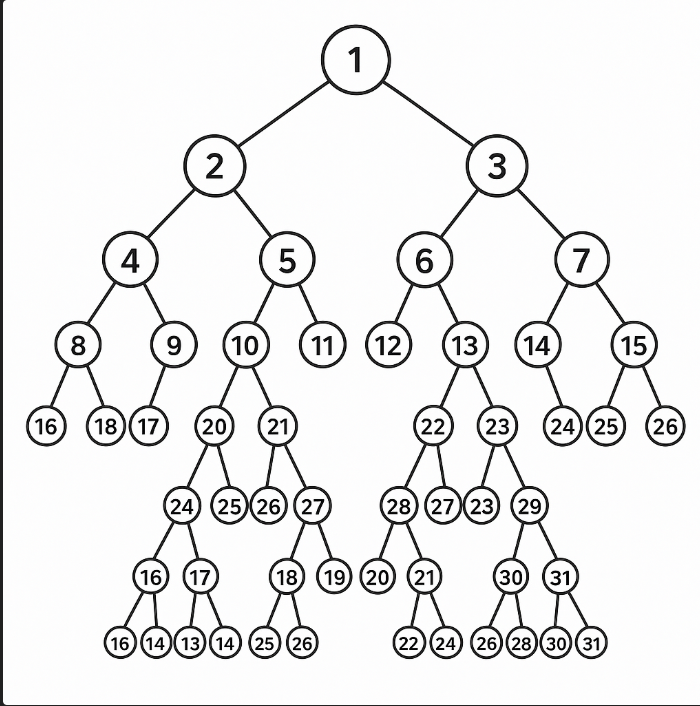

---
tags:
  - algorithm
  - trees
  - balancing-algorithm
  - heap-algorithm
  - traversal-algorithm
date: 2025-09-26
---
Tree
=========

### Leet Code

* [94. Binary Tree Inorder Traversal](https://leetcode.com/problems/binary-tree-inorder-traversal/description/)
* [226. Invert Binary Tree](https://leetcode.com/problems/invert-binary-tree/description/)

Content
---------------

*Inorder, Preorder, Postorder, Level Order*

* [Tree-Traversal](./Tree-Traversal/Tree-Traversal.md)
  * Preorder
  * Inorder
  * Postorder
  * LevelOrder (BFS Style)
* [Balancing](./Balancing/Balancing.md)
  * AVL Tree Rotations
  * Red-Black Tree Fixes
* [Heap Operations](./Heap%20Operations/Heap%20Operations.md)
  * Heapify
  * Insert / Delete in Heap
  * HeapSort
* Other Tree Problems
  * Lowest Common Ancestor (LCA)
  * Segment Tree Operations
  * Fenwick Tree (Binary Indexed Tree)


### Scripts

* [Trees in Python 🐍](./Python/Tree%20(Python%20🐍).md)


Related
----------------------------

* [Binary Search Tree BST -- geeksforgeeks](https://www.geeksforgeeks.org/dsa/binary-search-tree-data-structure/)
* [Binary Tree Data Structure -- geeksforgeeks](https://www.geeksforgeeks.org/dsa/binary-tree-data-structure/)


**A tree :)**




In python 🐍 :) + its inverted version

```python
from __future__ import annotations
import typing as t
from dataclasses import dataclass, field


@dataclass
class Node:
    value: t.Any
    left: Node | None = field(default=None)
    right: Node | None = field(default=None)


@dataclass
class Tree:
    root: Node | None = field(default=None)


tree = Tree(
    root=Node(1,
        left=Node(2,
            left=Node(4,
                left=Node(8,
                    left=Node(16),
                    right=Node(17),
                ),
                right=Node(9,
                    left=Node(18),
                    right=Node(19),
                ),
            ),
            right=Node(5,
                left=Node(10,
                    left=Node(20),
                    right=Node(21),
                ),
                right=Node(11,
                    left=Node(22),
                    right=Node(23),
                ),
            ),
        ),
        right=Node(3,
            left=Node(6,
                left=Node(12,
                    left=Node(24),
                    right=Node(25),
                ),
                right=Node(13,
                    left=Node(26),
                    right=Node(27),
                ),
            ),
            right=Node(7,
                left=Node(14,
                    left=Node(28),
                    right=Node(29),
                ),
                right=Node(15,
                    left=Node(30),
                    right=Node(31),
                ),
            ),
        ),
    ),
)

tree_huge_inverted = Tree(
    root=Node(1,
        left=Node(3,
            left=Node(7,
                left=Node(15,
                    left=Node(31),
                    right=Node(30),
                ),
                right=Node(14,
                    left=Node(29),
                    right=Node(28),
                ),
            ),
            right=Node(6,
                left=Node(13,
                    left=Node(27),
                    right=Node(26),
                ),
                right=Node(12,
                    left=Node(25),
                    right=Node(24),
                ),
            ),
        ),
        right=Node(2,
            left=Node(5,
                left=Node(11,
                    left=Node(23),
                    right=Node(22),
                ),
                right=Node(10,
                    left=Node(21),
                    right=Node(20),
                ),
            ),
            right=Node(4,
                left=Node(9,
                    left=Node(19),
                    right=Node(18),
                ),
                right=Node(8,
                    left=Node(17),
                    right=Node(16),
                ),
            ),
        ),
    )
)
```