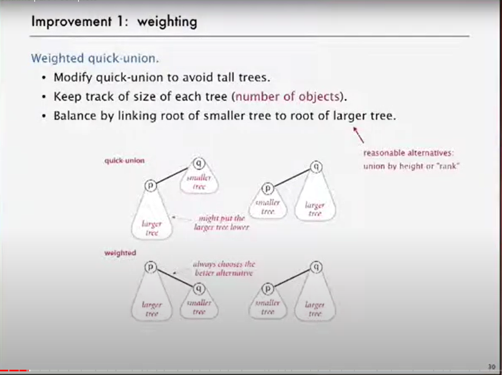
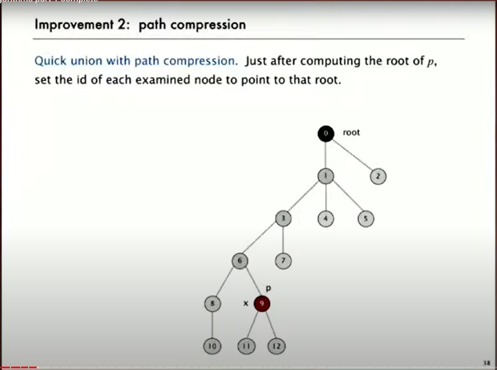

* [Algorithms part 1 complete](https://www.youtube.com/watch?v=9diDWV-fOnE&t=1374s)

Quick Union Improvement
-----------------------

### 1 Weighting 

#### Weighted quick-union

Basically, when you union you connect the smaller --> bigger tree.

### 2 Path Compression

Basically, it will 'level up' or 'flatten' the tree while scanning the tree!

